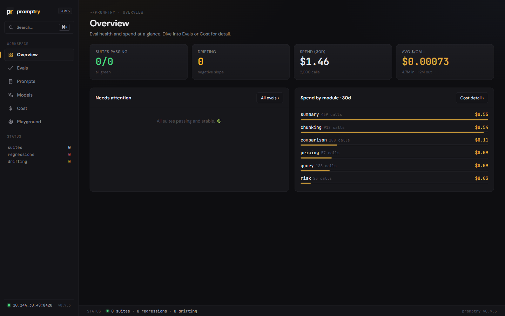
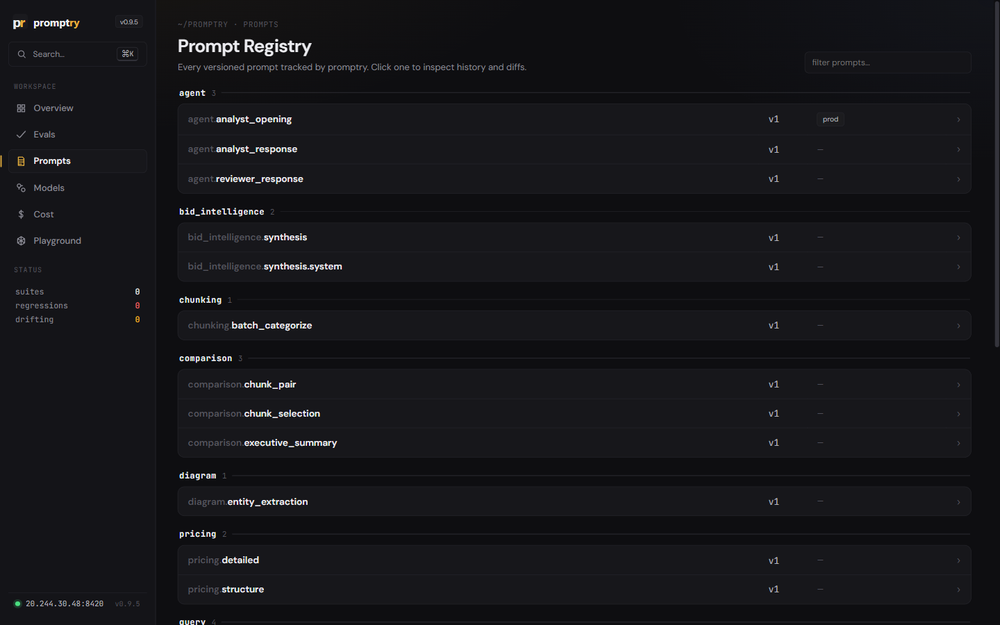
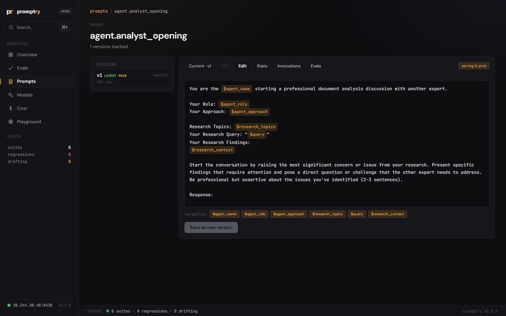
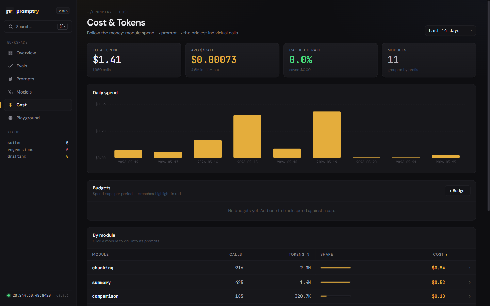
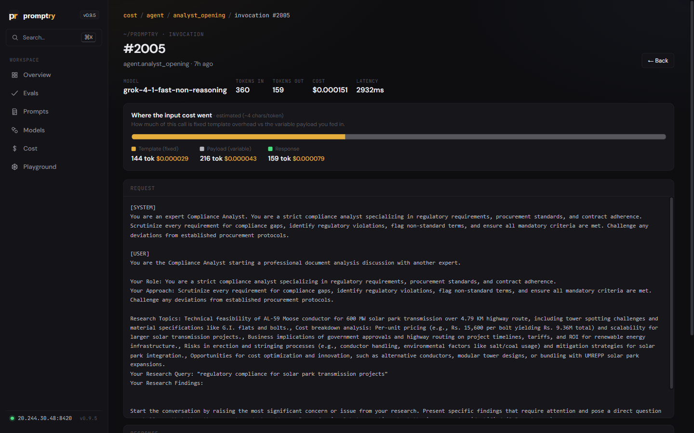
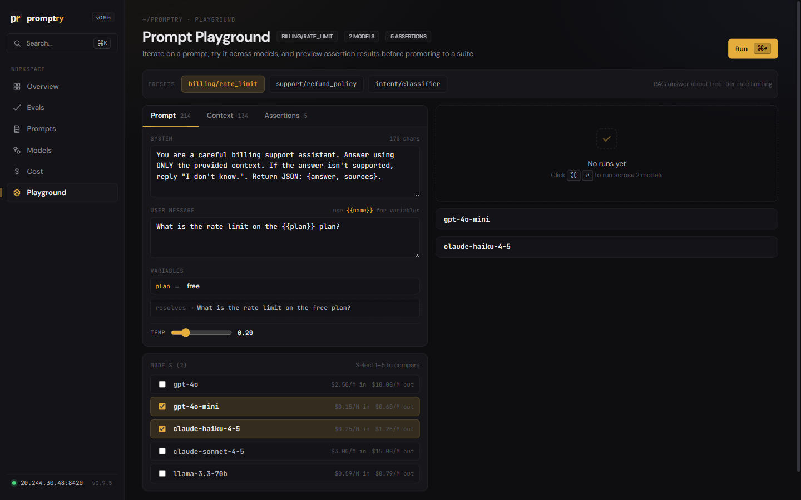

# promptry

[](https://pypi.org/project/promptry/)
[](https://www.npmjs.com/package/promptry-js)
[](https://github.com/bihanikeshav/promptry/actions/workflows/ci.yml)
[](https://python.org)
[](LICENSE)

**Local-first prompt observability that lives in your repo.** Version your prompts, write eval suites in Python, track the cost of every call, edit prompts live, and catch regressions in CI. One `pip install`, one SQLite file, zero services — your prompts never leave your laptop.

**[Try the live demo →](https://promptry.meownikov.xyz/demo/)** · [Integration guide](docs/INTEGRATION.md) · [Docs](https://promptry.meownikov.xyz/docs.html)

```python
from promptry import track, suite, assert_semantic

# track() content-hashes your prompt and stores a new version if it changed
prompt = track(system_prompt, "rag-qa")
response = llm.chat(system=prompt, ...)

# suites are regular Python functions. run them via CLI or in CI.
@suite("rag-regression")
def test_quality():
    response = my_pipeline("What is photosynthesis?")
    assert_semantic(response, "Converts light into chemical energy")
```

When a suite regresses against its baseline, promptry reports **what** changed:

```
Overall score: 0.910 -> 0.720  REGRESSION

Probable cause:
  -> Prompt changed (v3 -> v4)
```

## Install

```bash
pip install promptry                       # core
pip install promptry[semantic]             # + semantic assertions (sentence-transformers)
pip install promptry[dashboard]            # + web dashboard
pip install promptry[semantic,dashboard]   # everything
```

## Quick start

```bash
promptry init                              # scaffold project + starter eval
promptry run smoke-test --module evals     # run it
```

```
PASS test_basic_quality (142ms)
  semantic (0.891) ok

Overall: PASS  score: 0.891
```

## Features

| Feature | What it does |
|---------|--------------|
| **Prompt versioning** | Content-hashed, automatic dedup, grouped by module. No manual bumps, no YAML, no git dance. |
| **Live prompt CMS** | `render_prompt()` serves dashboard-edited `{{name}}` templates with no redeploy. Edit a prompt in the browser, your app picks it up on the next call. Substitution is value-driven, so JSON braces and literal `$` are never mistaken for variables. |
| **Semantic prompt search** | Search the registry by meaning and flag near-duplicate prompts (likely forks to consolidate). Embeddings with a lexical fallback. |
| **Environment promotion** | dev → staging → prod tags gate every edit before it reaches users. Promote a version, roll one back. |
| **Python-native suites** | `@suite` decorators, not YAML. Loops, fixtures, and your IDE's debugger all work. |
| **Deterministic assertions** | Semantic, schema, JSON, regex, grounding, tool-use. Zero API calls at CI time. |
| **LLM-as-judge** | Opt-in, not default. You decide when to spend tokens on evaluation. |
| **Drift detection** | Mann-Whitney U on a rolling window with real p-values — on eval scores *and* on live production telemetry (cost, latency, output length, rating). |
| **Regression diff** | Tells you *what* changed — prompt version, model, or data — not just that it broke. |
| **Regression bisect** | Walks the run history to pinpoint the first run that broke a test. |
| **SLO gates** | `[slo]` latency budgets fail CI on performance regressions, independent of the eval score. |
| **Judge-cost attribution** | LLM-judge spend estimated and summed per eval run, so you see what evaluation itself costs. |
| **Eval-from-trace** | Promote a real captured invocation into a per-prompt golden set, then re-run it against any model to check accuracy. |
| **Model comparison** | Statistical comparison against the historical baseline, not snapshot-to-snapshot. |
| **Invocations ledger** | Every call recorded: tokens, cost, latency, model. Opt-in sampled request/response trace capture; per-call ratings/feedback via `POST /api/feedback`. |
| **Cost tracking** | Per-model pricing with module → prompt → call drill-down, per-call template-vs-payload split, and a coverage check that flags un-priced models. Cache-aware, across OpenAI, Anthropic, Gemini, Grok. |
| **Budgets** | Daily and monthly spend caps with breach alerts. |
| **PII / secret scanning** | Captured request/response text is scanned for API keys, private keys, JWTs, emails, SSNs, and card numbers; the dashboard warns with masked findings. |
| **Safety suite** | 25 jailbreak / injection / PII / encoding templates across 6 categories. Extensible via `templates.toml`. |
| **MCP server** | First-class: your LLM agent drives the whole test runner. Native, not a plugin. |
| **Dashboard** | Local web UI for eval history, prompt registry + live editing, cost drill-down, model comparison, invocation traces, and a multi-model playground. No account, no cloud. |
| **Project config** | Committable `.promptry/config.toml` (models, judge, dashboard prefs, pricing overrides). API keys via env. |
| **JS/TS client** | Ship prompt events from frontend/Node apps to the same SQLite store. |

## Dashboard

```bash
pip install promptry[dashboard]
promptry dashboard
```

Eval health and spend at a glance — drill into evals or cost for detail.


The prompt registry, grouped by module. Click any prompt to inspect versions, diffs, and stats.


A prompt detail view: edit the live `$`-placeholder template, with variable pills and promotion tags.


Cost, drilled module → prompt → the priciest individual calls.


A single call, broken into fixed template overhead vs the variable payload you fed in.


The playground: render a prompt and compare it across models before promoting to a suite.


## Why promptry

Three things you won't get elsewhere — together, in one tool:

1. **Code, not YAML.** Suites are pytest-style decorators. Loops, fixtures, debugger breakpoints, IDE autocomplete. Promptfoo makes you generate YAML from Python scripts once your suite grows past a few dozen tests. Just skip the round trip.
2. **Local by design.** One SQLite file. No account, no API key for the framework, no cloud to trust. LangSmith and DeepEval's flagship features push your prompts and outputs to their servers — disqualifying for regulated industries, IP-sensitive work, or anyone who reads their procurement policy.
3. **No per-run judge tax.** Most assertions are deterministic: semantic similarity, schema, JSON, regex, grounding, tool-use. CI runs cost $0. RAGAS's headline metrics (faithfulness, answer relevancy, context precision) all need judge-model calls — every run costs tokens, adds latency, and drifts when the judge model updates. We treat LLM-as-judge as an opt-in, not a default.

| | Promptfoo | RAGAS | LangSmith | DeepEval | **promptry** |
|---|---|---|---|---|---|
| **Config** | YAML | Python metrics | SaaS UI | Python | **Python decorators** |
| **Data location** | Local | Local | **Their cloud** | Local + push | **Local SQLite** |
| **Account required** | No | No | **Yes** | No (for OSS) | **No, ever** |
| **CI cost per run** | Mixed | **Per-judge-call** | Trace volume | **Per-judge-call** | **$0 (deterministic)** |
| **Prompt versioning** | Manual + git | None | Prompt Hub | None | **Automatic content-hash** |
| **Live prompt editing** | None | None | Prompt Hub (cloud) | None | **Dashboard, no redeploy** |
| **Drift detection** | None | None | Dashboards only | None | **Mann-Whitney U + p-values** |
| **Cost budgets + alerts** | None | None | Usage charts only | None | **Daily/monthly caps** |
| **MCP server** | Plugin | None | None | Partial | **Native** |
| **Commercial tier** | Promptfoo Enterprise | None | LangSmith (SaaS) | Confident AI | **None planned** |

## GitHub Action

Run eval suites in CI with one line. On pull requests it posts (or updates) a single comment summarizing the eval: overall score, pass/fail counts, and any regressed tests vs. the previous run. [View on Marketplace.](https://github.com/marketplace/actions/promptry-eval)

```yaml
# .github/workflows/eval.yml
name: Eval
on: [push, pull_request]
jobs:
  eval:
    runs-on: ubuntu-latest
    permissions:
      contents: read
      pull-requests: write  # required for PR comments
    steps:
      - uses: actions/checkout@v4
      - uses: bihanikeshav/promptry@v0.10.0
        with:
          suite: rag-regression
          module: evals
          compare: prod  # optional — compare against baseline
```

Example PR comment on a regression:

```markdown
## promptry eval: rag-regression

| | Current | Baseline | Delta |
|---|---|---|---|
| Overall score | 0.891 | 0.910 | -0.019 |
| Passed | 8/10 | 9/10 | -1 |
| Status | REGRESSED | PASS | |

**Regressions:**
- `test_photosynthesis_answer`: semantic 0.89 -> 0.72 (-0.17)
- `test_schema_validation`: passed -> **failed**

_Generated by [promptry](https://github.com/bihanikeshav/promptry)_
```

Subsequent pushes edit the same comment instead of spamming new ones.

| Input | Required | Default | Description |
|-------|----------|---------|-------------|
| `suite` | Yes | | Eval suite name |
| `module` | Yes | | Python module containing the suite |
| `compare` | No | | Baseline tag to compare against |
| `python-version` | No | `3.12` | Python version |
| `extras` | No | `semantic` | pip extras to install |
| `pr-comment` | No | `true` | Post/update a PR comment with results |
| `github-token` | No | `${{ github.token }}` | Token used to post PR comments |

## MCP server

```bash
claude mcp add promptry -- promptry mcp    # Claude Code
```

Works with Claude Desktop, Cursor, Windsurf, VS Code. See [full setup](docs/guide.md#mcp-server-llm-agent-integration).

## Documentation

The [full guide](docs/guide.md) covers all assertions, cost tracking, model comparison, safety templates, notifications, storage modes, JS client, CLI reference, MCP setup, and config options.

## Scope

Promptry is local-first by design. If you need a hosted, always-on observability product for production traffic with team seats and SSO, use LangSmith or Arize — different product category. Promptry runs against one SQLite file on your machine: wire it into CI so a bad prompt change never reaches production, manage your live prompts from the dashboard, and keep a per-call ledger of cost and traces without sending anything to a vendor.

Shipped: everything in the feature table above, across Python + JS + CLI + dashboard + MCP + GitHub Action — including the live prompt CMS with environment promotion, the per-call invocations ledger with opt-in request/response capture and feedback ingest, cost-by-module drill-down with budgets, and regression bisect.

On the roadmap: agent trajectory analysis and LLM-powered root cause.

## License

MIT
